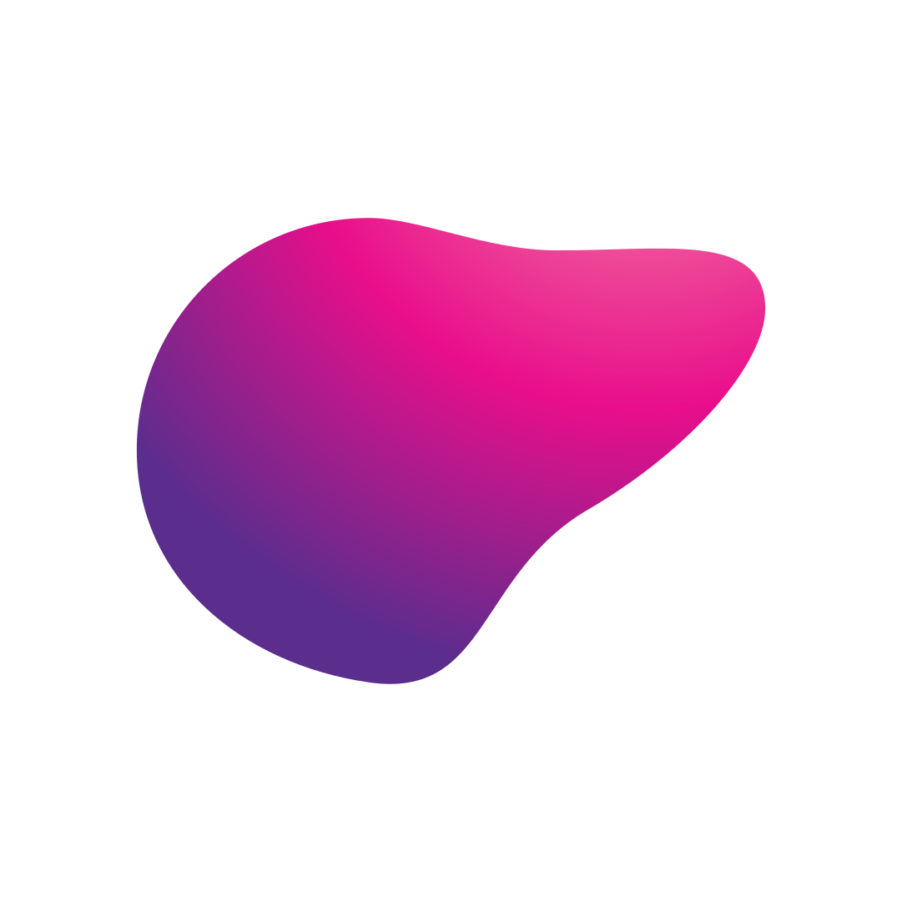
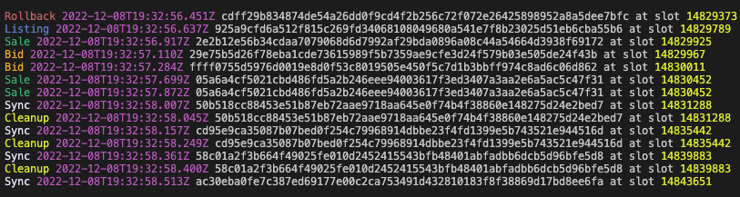

<p align="center">
  
  <h1 align="center">Nebula</h1>
  <p align="center">A Cardano NFT marketplace contract including chain indexer and event listener for individual projects.</p>
</p>

⚠️ The contract hasn't been thoroughly tested yet. Use the contract at your own risk. Changes/improvements will still happen. Changes can also be breaking.

## Requirements

- [Deno](https://deno.land/) $\ge$ Version 1.28.3

## 🚀 Quick start

1. Import `Contract` and `Lucid` and create royalty/fee token.

```ts
import { Contract } from "https://deno.land/x/nebula@0.1.0/contract/mod.ts"
import { Lucid, Blockfrost } from "https://deno.land/x/lucid@0.7.9/mod.ts"

const lucid = await Lucid.new(
  new Blockfrost(
    "https://cardano-preprod.blockfrost.io/api/v0",
    "<project_id>",
  ),
  "Preprod",
);

lucid.selectWalletFromSeed(
  "<seed_phrase>",
);

const owner = "addr...";

const txHash = await Contract.createRoyalty(
  lucid,
  [{
    recipient:
      "addr...",
    fee: 0.016, // 1.6%
    fixedFee: 1500000n, // lovelace
  }], 
  owner,
);
console.log(txHash);
```

This creates a unique royalty token and sends it to a script address controlled by the owner. The output contains the royalty/fee information. After calling `Contract.createRoyalty(..)` you should see a message in the terminal including the `royalty token`. Paste it into the Contract config as described in the next step.

2. Instantiate the contract and deploy reference scripts.

```ts
const contract = new Contract(lucid, {
  royaltyToken:
    "<royalty_token>",
  owner, // Make sure you use the same owner here as in Contract.createRoyalty(..)!
  policyId: "<policy_id_of_your_nft_project>",
});

console.log(await contract.deployScripts());
```

After calling `contract.deployScripts()` you should see a message in the terminal including the `tx hash` of the deployment of the scripts. Paste it into the Contract config as described in the next step.

3. Re-instantiate the contract with reference scripts.

```ts
const contract = new Contract(lucid, {
  royaltyToken:
    "<royalty_token>",
  owner, // Make sure you use the same owner here as the one in Contract.createRoyalty(..)!
  policyId: "<policy_id_of_your_nft_project>",
  deployTxHash: "<deploy_tx_hash>",
});
```

Now the contract is initialised.\
**Make sure you don't change the configuration as it could change the script hashes!**

Time to play with the marketplace!

Place a bid (on SpaceBud #10):
```ts
console.log(await contract.bid(idToBud(10), 5000000000n));
```

Accept bid (sell):
```ts
const [bid] = await contract.getBids(idToBud(10));
console.log(await contract.sell([{ bidUtxo: bid }]));
```

List an NFT (SpaceBud #10):
```ts
console.log(await contract.list(idToBud(10), 6000000000n));
```

Buy:
```ts
const [listing] = await contract.getListings(idToBud(10));
console.log(await contract.buy([listing]));
```

Place a floor/open bid with optional constraints (this only works if your NFT is CIP-0068 compliant):
```ts
console.log(
  await contract.bidOpen(10000000000n, {
    types: ["Bear"],
    traits: [{ trait: "Hockey Stick" }],
  }),
);
```

Accept open bid (with SpaceBud #650 as it is a Bear and has a Hockey Stick):
```ts
const [bid] = await contract.getBids("open");
console.log(await contract.sell([{ bidUtxo: bid, assetName: idToBud(650) }]));
```

And much more is possible!

## Nebula Watcher

If you want to keep track of historic data or want to index marketplace data or want to listen to certain events, then you may want to run the watcher.\
It is not a requirement to run the core of the marketplace.

### Requirements

- [Deno](https://deno.land/) $\ge$ Version 1.28.3
- [Ogmios](https://ogmios.dev/) $\ge$ Version 5.5.7
- Active connection to a Cardano node with Ogmios as bridge.

1. Set up the `config.ts` file:

**Tip**: Call `contract.getContractHashes()` on your Contract instance to get all the relevant hashes you need for the config.

```ts
import {
  BidAndListingBundleEventData,
  BidAndListingSingleEventData,
  BidOpenEventData,
  Config,
  MarketplaceEvent,
  SaleBundleEventData,
  SaleSingleEventData,
} from "https://deno.land/x/nebula@0.1.0/src/types.ts";


/** 
 * Run 'contract.getContractHashes()' on your Contract instance to get all the relevant hashes you need for the config.
 */
export const config: Config = {
  scriptHash: "<script_hash>",
  bidPolicyId: "<bid_policy_id>",
  projects: ["<nft_policy_id>"],
};

// optionally handle events
export function eventsHandler(events: MarketplaceEvent[]) {
  for (const event of events) {
    switch (event.type) {
      case "BidBundle": {
        const eventData: BidAndListingBundleEventData = event.data;
        // Your logic here
        break;
      }
      case "BidOpen": {
        const eventData: BidOpenEventData = event.data;
        // Your logic here
        break;
      }
      case "BidSingle": {
        const eventData: BidAndListingSingleEventData = event.data;
        // Your logic here
        break;
      }
      case "ListingBundle": {
        const eventData: BidAndListingBundleEventData = event.data;
        // Your logic here
        break;
      }
      case "ListingSingle": {
        const eventData: BidAndListingSingleEventData = event.data;
        // Your logic here
        break;
      }
      case "BuyBundle": {
        const eventData: SaleBundleEventData = event.data;
        // Your logic here
        break;
      }
      case "BuySingle": {
        const eventData: SaleSingleEventData = event.data;
        // Your logic here
        break;
      }
      case "SellBundle": {
        const eventData: SaleBundleEventData = event.data;
        // Your logic here
        break;
      }
      case "SellSingle": {
        const eventData: SaleSingleEventData = event.data;
        // Your logic here
        break;
      }
      case "CancelBidBundle": {
        const eventData: BidAndListingBundleEventData = event.data;
        // Your logic here
        break;
      }
      case "CancelBidOpen": {
        const eventData: BidOpenEventData = event.data;
        // Your logic here
        break;
      }
      case "CancelBidSingle": {
        const eventData: BidAndListingSingleEventData = event.data;
        // Your logic here
        break;
      }
      case "CancelListingBundle": {
        const eventData: BidAndListingBundleEventData = event.data;
        // Your logic here
        break;
      }
      case "CancelListingSingle": {
        const eventData: BidAndListingSingleEventData = event.data;
        // Your logic here
        break;
      }
    }
  }
}
```

2. Start the watcher:

```
deno run -A https://deno.land/x/nebula@0.1.0/watcher/mod.ts --ogmios-url ws://localhost:1337 --database ./marketplace.sqlite --config ./config.ts
```



## Nebula Querier

Run the querier: 

```
deno run -A https://deno.land/x/nebula@0.1.0/watcher/querier.ts --database ./marketplace.sqlite
```

Runs on port `3000` by default. It hosts the database and allows you to make simple queries. The API will likely be extended and improved over time.

## Nebula Contract

To execute the below listed commands you need to be in the `contract` directory.

### Bundle for NPM/Node

```
deno task build
```
Outputs a `dist` folder at `./contract/dist`.

### Compile contract

See [requirements](./contract/src/ghc/README.md).

```
deno task build:contract
```

### Protocol fee

Nebula charges by default a protocol fee for each sale, which is currently about `0.9 ADA` (the minimum ADA by protocol parameters and it is adjusted automatically when the protocol parameters change). We appreciate all support to fund the development of Nebula. If you want to disable the protocol fee set the flag `fundProtocol` to `false` when instantiating the `Contract`.


## Todo

- [ ] Improve and extend documentation.
- [ ] Move contract to Aiken.
- [ ] Make the Nebula contract also available on NPM as official package.

